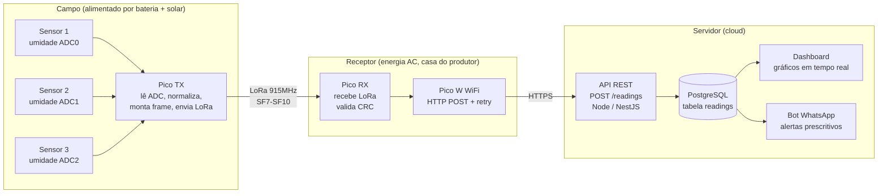

# Arquitetura — AquaSense

> Substituímos o link UART original por **LoRa** (915 MHz, banda livre BR) para permitir que o nó de campo fique a centenas de metros do receptor sem cabo.

## Visão geral

Três camadas físicas: **Campo**, **Receptor**, **Servidor**.

## Fluxo da leitura (a cada 30 s)

1. **Pico TX** lê ADC dos 3 sensores capacitivos (0–65535).
2. Normaliza para `0.0–1.0` (`raw / 65535`).
3. Monta frame binário compacto: `device_id | seq | s1 | s2 | s3 | bat | crc16`.
4. Transmite via LoRa (SX1276/RFM95).
5. **Pico RX** recebe, valida CRC, descarta duplicatas (por `seq`).
6. Monta JSON `{"device_id": "...", "s1": 0.72, "s2": 0.55, "s3": 0.81, "bat": 3.85, "ts": "..."}`.
7. `POST /readings` via WiFi com 3 tentativas e backoff linear.
8. **API** valida payload, persiste em `readings`, retorna `201`.
9. Dashboard atualiza em tempo real; regra de alerta dispara WhatsApp se necessário.

Latência total alvo: ~1–2 s do envio LoRa até o `INSERT` no banco.

## Protocolos

| Trecho | Protocolo | Formato | Notas |
|---|---|---|---|
| Sensor → Pico TX | ADC analógico | int 0–65535 | 12-bit do RP2040, padding para 16-bit |
| Pico TX → Pico RX | **LoRa** 915 MHz | Frame binário ~16 B | SF7 (rápido, ~300 m) a SF10 (lento, ~2 km). Duty cycle baixo (msg a cada 30 s) |
| Pico RX → API | HTTPS | JSON | TLS, retry 3x backoff linear |
| API → Postgres | TCP | SQL | `INSERT INTO readings (...)` |

## Premissas e restrições

- **Frequência LoRa:** 915 MHz (faixa ISM livre no Brasil — Anatel Resolução 680).
- **Alcance esperado:** 300 m a 2 km dependendo de SF e linha de visão. Nó de campo deve ter linha de visão razoável até a casa.
- **Energia do nó de campo:** bateria 18650 + painel solar pequeno. Pico TX dorme entre leituras (`machine.deepsleep`).
- **Tamanho do frame:** mantido < 32 B para caber em SF10 sem fragmentação.
- **Segurança:** payload LoRa assinado (HMAC simples com chave pré-compartilhada por device) para evitar injeção.
- **Identificador:** `device_id` é o serial do RP2040 (`machine.unique_id()`).

## Decisões registradas

- [ADR 0001 — LoRa no lugar de UART](./decisions/0001-lora-em-vez-de-uart.md)

## Não está no escopo do MVP

- Múltiplos receptores / mesh LoRa.
- Atuação automática (abertura/fechamento de válvula).
- Sincronização offline-first no dashboard.
