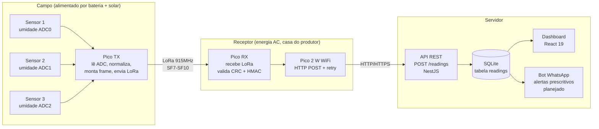
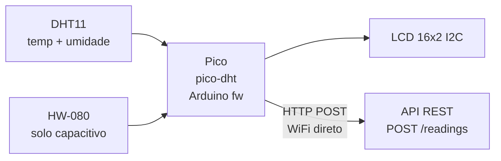

# Arquitetura — AquaSense

> Substituímos o link UART original por **LoRa** (915 MHz, banda livre BR) para permitir que o nó de campo fique a centenas de metros do receptor sem cabo. Veja [ADR 0001](./decisions/0001-lora-em-vez-de-uart.md).

## Visão geral

Três camadas físicas: **Campo**, **Receptor**, **Servidor**.

> **MVP:** banco é SQLite (`aquasense.db`) rodando local junto ao servidor.
> A migração para PostgreSQL está planejada para quando o sistema for para produção — veja [ADR 0002](./decisions/0002-sqlite-para-mvp.md).

## Protótipo v1 — pico-dht (Etapa 0)

Antes de implementar o link LoRa, um protótipo mais simples valida o contrato da API e os sensores físicos:

O `pico-dht` conecta direto ao WiFi (sem LoRa), envia `humidity`, `temperature_c`, `soil_wet`, `soil_moisture_pct` e `ts` a cada 30 s. Detalhes em [ADR 0007](./decisions/0007-prototipo-pico-dht.md).

## Fluxo da leitura (arquitetura alvo, a cada 30 s)

1. **Pico TX** lê ADC dos 3 sensores capacitivos (0–4095, 12-bit, com oversampling ×8).
2. Monta frame binário de 24 bytes: `device_id(8) | seq(2) | s1(2) | s2(2) | s3(2) | bat_mv(2) | hmac4(4) | crc16(2)`.
3. Assina com HMAC-SHA256 truncado (4 bytes) usando PSK pré-compartilhado por dispositivo.
4. Calcula CRC-16/CCITT-FALSE sobre `payload + hmac`.
5. Transmite via LoRa (SX1276/RFM95).
6. **Pico RX** recebe, verifica CRC e HMAC, descarta duplicatas por `seq`.
7. `POST /readings` via WiFi com retry exponencial.
8. **API** valida payload (class-validator), persiste em SQLite, retorna `201`.
9. Dashboard atualiza a cada 30 s via polling; alerta WhatsApp se necessário (planejado).

Latência total alvo: ~1–2 s do envio LoRa até o `INSERT` no banco.

## Frame binário (24 bytes, little-endian)

| Offset | Tamanho | Campo | Descrição |
|---|---|---|---|
| 0 | 8 B | `device_id` | Serial único do RP2040/RP2350 |
| 8 | 2 B | `seq` | Contador sequencial (uint16 LE), persiste em flash |
| 10 | 2 B | `s1` | ADC sensor 1 (0–4095, pad 16-bit) |
| 12 | 2 B | `s2` | ADC sensor 2 |
| 14 | 2 B | `s3` | ADC sensor 3 |
| 16 | 2 B | `bat_mv` | Tensão da bateria em mV |
| 18 | 4 B | `hmac4` | HMAC-SHA256(payload[0..17], PSK) truncado |
| 22 | 2 B | `crc16` | CRC-16/CCITT-FALSE sobre bytes 0..21 |

Veja [ADR 0006](./decisions/0006-frame-binario-hmac-crc.md) para a justificativa do formato.

## Protocolos

| Trecho | Protocolo | Formato | Notas |
|---|---|---|---|
| Sensor → Pico TX | ADC analógico | int 0–4095 | 12-bit do RP2040/RP2350, oversampling ×8 |
| Pico TX → Pico RX | **LoRa** 915 MHz | Frame binário 24 B | SF7 (~300 m) a SF10 (~2 km). 1 msg a cada 30 s |
| Pico RX → API | HTTP (MVP) / HTTPS (prod) | JSON | retry 3× backoff exponencial |
| API → SQLite | in-process | SQL | `INSERT INTO readings (...)` via better-sqlite3 |

## Stack de software

| Camada | Tecnologia | Decisão |
|---|---|---|
| Firmware | C++17, PlatformIO, Pico SDK | [ADR 0003](./decisions/0003-cpp-platformio.md) |
| Backend | NestJS 11, TypeScript strict | [ADR 0004](./decisions/0004-nestjs-backend.md) |
| Frontend | React 19, Vite 8 | [ADR 0005](./decisions/0005-react-vite-frontend.md) |
| Banco MVP | SQLite + better-sqlite3 | [ADR 0002](./decisions/0002-sqlite-para-mvp.md) |

## Premissas e restrições

- **Frequência LoRa:** 915 MHz (faixa ISM livre no Brasil — Anatel Resolução 680).
- **Alcance esperado:** 300 m a 2 km dependendo de SF e linha de visão.
- **Energia do nó de campo:** bateria 18650 + painel solar pequeno. Pico TX dorme entre leituras.
- **Tamanho do frame:** 24 B, cabe em SF10 sem fragmentação (payload máximo ~51 B em SF10/BW125).
- **Segurança:** HMAC-SHA256 com PSK por dispositivo (gerado com `openssl rand -hex 32`). TLS verificado somente em produção.
- **Identificador:** `device_id` é o serial do RP2040/RP2350 (8 bytes únicos por chip).

## Fora do escopo do MVP

- Múltiplos receptores / mesh LoRa.
- Atuação automática (abertura/fechamento de válvula).
- Sincronização offline-first no dashboard.
- Migração para PostgreSQL (planejada para S2).
- Bot WhatsApp (planejado para S3+).
